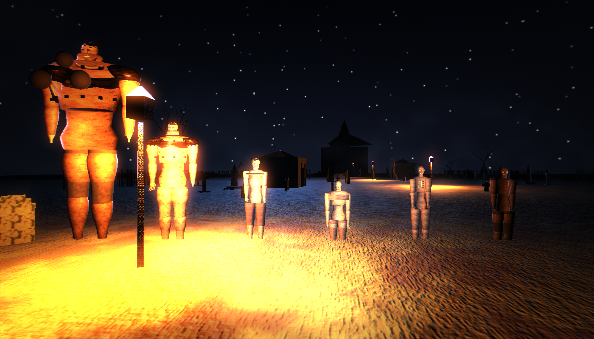
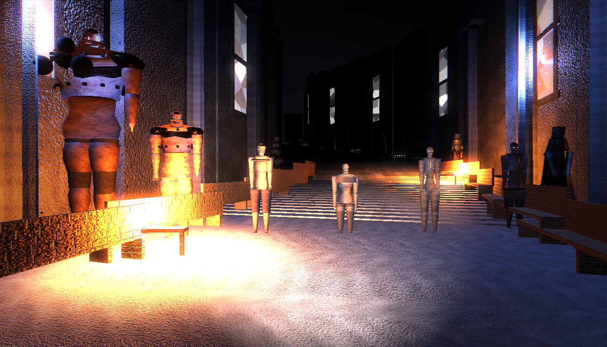
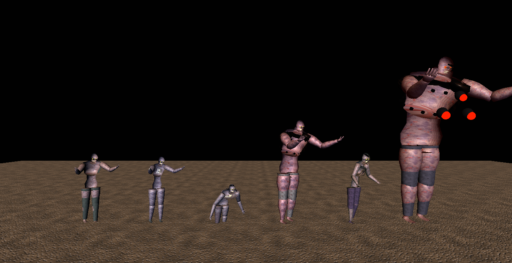

# Crimson Rail

A 3D zombie shooter for macOS, in the tradition of *The House of the Dead* —
with the rail taken off. You walk the levels yourself: WASD to move, mouse to
look, and you decide what to shoot first.

Five levels, six enemy archetypes, a boss, and a scoring system that rewards
headshots and punishes panic.


*Level 1 — the cemetery. Moonlight defines the silhouettes, lanterns mark the route.*

## Running it

```bash
./build.sh --run
```

That produces `build/Crimson Rail.app` and launches it. The bundle is
self-contained — no external assets, no frameworks to install — and can be moved
to `/Applications` and launched from Finder **on the machine that built it**.

Requires macOS 14 or later and a Swift 6 toolchain (Xcode 16+).

### Distributing it to other Macs

`build.sh` signs the bundle **ad-hoc** (`Signature=adhoc`, no Team Identifier),
which is enough for local use but is *not* accepted by Gatekeeper elsewhere —
`spctl -a -t exec` rejects it. If you copy the app to another Mac it will be
blocked on first launch.

Making it properly distributable needs an Apple Developer ID, which this build
does not have:

```bash
codesign --force --deep --options runtime \
         --sign "Developer ID Application: YOUR NAME (TEAMID)" "build/Crimson Rail.app"
xcrun notarytool submit "Crimson Rail.zip" --keychain-profile "AC_PASSWORD" --wait
xcrun stapler staple "build/Crimson Rail.app"
```

Without that, a recipient has to right-click → Open once, or clear the quarantine
attribute themselves (`xattr -dr com.apple.quarantine "Crimson Rail.app"`).

## Controls

| Input | Action |
|---|---|
| `W` `A` `S` `D` | Move (arrow keys also work) |
| `Shift` | Sprint |
| Mouse | Look and aim |
| Left click | Fire |
| `R` / right click | Reload |
| `P` / `Esc` | Pause |
| `F` | Toggle full screen |
| `Cmd-Q` | Quit |

Mouse sensitivity, Y inversion, crosshair, camera sway and screen shake are all
in the settings screen.

## The game

### Movement and level structure

The five levels were originally authored as rails — a spline through the world
with encounters scripted at distances along it. Rather than throw that away, the
rail became the level's **spine**: the player's position is projected onto it to
answer "how far through the level am I", which is what every encounter trigger,
the progress bar and the objective marker read. All five level scripts survived
the change unedited.

Encounters **seal their arena** while they run. You can circle, retreat and
reposition inside it, but you cannot walk past a fight to the exit — without
that, a simulated player cleared level 1 in 45 seconds by ignoring every
encounter, and the authored pacing became scenery.

**Five levels**, each a different place with its own lighting language:

1. **The Gate** — Ashwood Cemetery. Moonlight, fog, lanterns.
2. **Guest of the House** — the manor interior. Candles only; no key light at all.
3. **Fire in the Street** — Vessel Row, burning. Lit from below, in the rain.
4. **Patient Zero** — Sublevel Seven. Failing fluorescents and red emergency strips.
5. **Vespers** — the spire. Stained glass, a storm, and the Warden.


*Level 5 — the spire. Stained glass, candles, and a storm.*

### The enemies

Six archetypes, each asking a different question — and each built as a different
body, not a palette swap. Bodies are lofted from cross-sections rather than
assembled from capsules, which is what buys shoulders, a brow ridge, a calf, a
wrist and a hand with fingers. Silhouette does the work of telling them apart,
because at fifteen metres in the dark it is all the player has.

| | Behaviour |
|---|---|
| **Shambler** | The baseline. Two body shots, or one to the head. |
| **Runner** | Fast and fragile. Punishes lingering. |
| **Crawler** | Low and quick — drags your aim down off head height. |
| **Brute** | Armoured torso; body shots ricochet. Headshots only. |
| **Spitter** | Hangs back and throws acid. The projectile is shootable. |
| **The Warden** | The finale. Armoured except for its weak points. |

| | Build |
|---|---|
| **Shambler** | Shirt and trousers, moderately decayed. The everyman. |
| **Runner** | Stripped to the waist, ribs exposed, no muscle left on it. |
| **Crawler** | Withered legs, over-developed arms, moves on its hands. |
| **Brute** | Plate bolted into the flesh, tiny head sunk between huge shoulders. |
| **Spitter** | Bloated gut and throat sac over thin limbs, in a filthy gown. |
| **The Warden** | Iron half-mask, pauldrons, and torn gaps of glowing tissue. |


*The full cast, mid-telegraph. Every model is generated from code at load time.*

Civilians appear in most levels. Shooting one costs 2,500 points and some
health; getting one out alive is a large bonus and a heal. They are marked with
a bright blue beacon, because the decision is made in half a second in the dark.

**Difficulty** — Rookie, Agent (intended), Nightmare. Rookie gives more health
and slower attackers; Nightmare speeds everything up and hits harder.

**Scoring** — base value per kill, doubled for headshots, multiplied by a combo
chain that builds on consecutive hits and breaks on a miss or on taking damage.
Accuracy and surviving health add end-of-level bonuses, and the result is graded
S through D.

## Everything is generated

There are no asset files. Not as a constraint for its own sake — it just means
the whole game is in the source:

- **Geometry** — every mesh is built from `MeshBuilder` primitives at load time.
  Gravestones, zombies, wrecked cars, stained glass, the cathedral.
- **Textures** — `TextureFactory` synthesises albedo, normal and roughness maps
  from tileable value noise, Worley cells and ridged fBm.
- **Audio** — `SoundBank` synthesises all 52 sounds, the ambience beds and three
  adaptive music stems through a small DSP toolkit. Zombie voices are a rasping
  pulse train pushed through formant filters.
- **The app icon** — drawn in Core Graphics by `--icon`.

Load time is 0.4–0.9 s per level, which is where that budget goes.

## Graphics settings

Four presets from Low to Ultra, auto-detected from the GPU on first launch, plus
individual control over shadows, ambient occlusion, bloom, film grain, motion
blur, render scale, particle budget and draw distance. Everything is adjustable
from the in-game settings screen.

Measured live on an M4 at 1440×900 in a window (so a 2880×1800 Retina backing
store), High preset: a locked 60 fps on all five levels, with the rebuilt enemy
models and free movement.

Getting there meant finding that shadows alone cost 6 ms/frame, and that almost
all of it was *omni* lights casting six-face cube shadow maps — a street with a
dozen lamps in range was spending a third of the frame budget on shadows nobody
looks at. On High only the key light casts; Ultra restores the rest.

`--perf` renders offscreen with a blocking wait per frame, which serialises CPU
and GPU and understates real pipelined performance. `CR_FPS=1` on the live app
is the number that matters.

## Development harnesses

Every one of these runs headless, with no window and no display required — they
work over SSH and on a sleeping screen.

```bash
./.build/release/CrimsonRail --selftest              # 650 invariant checks
./.build/release/CrimsonRail --balance --runs 4      # simulated playthroughs
./.build/release/CrimsonRail --perf                  # frame-time percentiles
./.build/release/CrimsonRail --audiotest --dir out   # render every sound to WAV
./.build/release/CrimsonRail --shot out.png --level 3 --at 60
./.build/release/CrimsonRail --solo cast.png --kind all --state windup
./.build/release/CrimsonRail --play 3          # boot straight into a level
CR_FPS=1 ./.build/release/CrimsonRail --play 3 # ...and log its live frame rate
```

`--balance` is the one that earned its keep. It plays every level at three skill
levels with a simulated player that has reaction delay and aim error, and the
whole matrix finishes in about four seconds. It found three bugs that would have
been miserable to catch by hand:

- Enemies converging on the player from **outside the camera frustum**, where
  they could bite but not be shot. Both a horizontal case (the attack arc was
  wider than the field of view) and a vertical one (a crawler at melee range sits
  below the bottom of the screen).
- A **soft-lock** at the end of a level when a straggler wandered off and the win
  condition waited for it forever.
- Level 5's cast standing **six metres below the player**, because its floor was
  flat while its rail climbed.
- Levels 2 and 4 loop back near their own start, so projecting the player onto
  the rail globally **snapped them from 114 m back to 4 m** as they neared the
  exit, re-arming every encounter and hanging the level. Projection is now
  hinted by the previous result.
- The Warden's enlarged chest capsule **shielding its own weak points**, which
  made the boss unkillable — caught as level 5 dropping to a 0% win rate.

`CR_SKIP=shadows,fog,sky,bloom,ao,weaponlight,particles` disables individual
renderer contributors, which is how the "the key light does nothing" bug was
bisected down to SceneKit's shadow projection.

## Layout

```
Sources/CrimsonRail/
├── Core/        maths, spline, settings, save data
├── Render/      mesh builder, procedural textures, materials
├── World/       player controller, navigation, props, sky, environments
├── Actors/      anatomy library, zombie bodies, animation, AI
├── Combat/      weapon, effects
├── Game/        playfield, session, director, top-level coordinator
├── Levels/      level and encounter definitions
├── Audio/       DSP toolkit, sound bank, audio director
├── UI/          SpriteKit HUD, SwiftUI menus
└── Dev/         harnesses
```

Built with Swift, SceneKit, Metal, SpriteKit, SwiftUI and AVAudioEngine.
